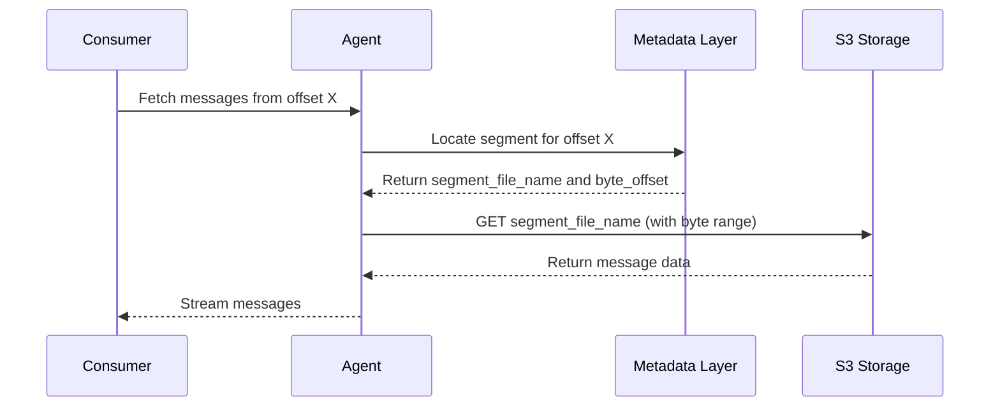
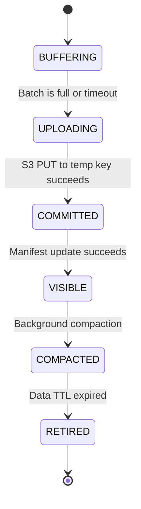

# ideas.md: Core Log Structure & High-Throughput on S3

This document explores the first item on the Krust roadmap: the implementation of the core log structure. It specifically addresses the challenge of achieving high throughput for a message bus built on a high-latency object store like Amazon S3.

## 1. The Core Log Structure

The fundamental data structure in Krust is a **distributed, append-only log**. This log is composed of a sequence of immutable files (log segments) stored in an object store. Each message is assigned a unique, monotonically increasing offset.

### Logical View

Logically, a topic partition is a continuous sequence of messages, ordered by their offsets.

```
| Msg 0 | Msg 1 | Msg 2 | ... | Msg N |
+-------+-------+-------+-----+-------+
Offset: 0       1       2           N
```

### Physical Implementation on S3

Physically, this continuous logical log is broken down into multiple **log segment files** stored in S3. A separate **metadata layer** is responsible for mapping a given offset to the specific S3 object (and the position within that object) where the message data resides.

-   **Log Segments**: These are immutable files containing a batch of messages. Once a segment is written to S3, it is never modified.
-   **Manifest/Index**: A file or set of files that contains the mapping from offsets to log segments. This is a critical component for efficient reads.

## 2. The Metadata Layer: The Heart of the System

The "log" is physically just a collection of segment files in S3. The real intelligence lies in the metadata layer, which provides the logical view of a continuous, ordered log. This layer is responsible for:

-   **Segment Discovery**: How do consumers know which S3 objects make up a shard's log?
-   **Offset Mapping**: Which segment file contains a specific offset?
-   **Consistency**: How do we prevent consumers from reading partially written or uncommitted segments?

The design of this layer is the most critical part of the system. Below are several options for its implementation.

### Metadata Storage Options

The choice of where and how to store metadata involves a trade-off between coordination complexity, cost, and operational overhead.

| Option | Storage Mechanism | Update Pattern | Consistency Model | Pros | Cons |
| :--- | :--- | :--- | :--- | :--- | :--- |
| **S3-Only Manifest** | A single manifest object per internal shard in S3. | **Mutable Head Pointer**: The manifest is a file that is read, updated in memory, and overwritten on S3 using conditional PUTs (`If-Match` with ETag) to ensure atomic updates. | **Atomic Updates**: Readers see a consistent view of the log. New segments become visible only when the manifest is successfully updated. | - No external dependencies<br>- Low operational overhead<br>- Cost-effective | - Potential for high contention on the single manifest object<br>- Complex to implement correctly (handling retries, ABA problem) |
| **Append-Only Manifests** | A series of manifest files in S3, linked together. | **Append-Only**: Instead of overwriting a single manifest, new metadata is written to a new, uniquely named manifest file. A "head" pointer object tracks the latest manifest. | **Eventual Consistency**: Readers list manifest files and merge them to get the current state. Requires a mechanism to discover the latest "head". | - Avoids contention on a single object<br>- Simpler write path | - More complex read path (listing and merging)<br>- Slower discovery of new segments | 
| **External Coordinator (DynamoDB/Etcd)** | Use a dedicated, strongly consistent database. | **Transactional Updates**: Use the database's atomic operations to update partition metadata. | **Strong Consistency**: The database is the source of truth. Readers query it to find the current set of log segments. | - Simplifies coordination logic<br>- Strong consistency guarantees<br>- Mature and well-understood | - Adds an external dependency<br>- Higher operational cost and complexity<br>- Potential for the coordinator to become a bottleneck |

For the MVP, the **S3-Only Manifest with a Mutable Head Pointer** is a strong candidate, as it aligns with the goal of having minimal external dependencies. However, it requires careful implementation to handle concurrency. The **External Coordinator** approach is a safer, more traditional alternative if the operational overhead is acceptable.

## 3. Read Path and Indexing: The Cost of Consumption

While the write path can be optimized by batching, the read path presents its own challenges. An inefficient read path can lead to a high number of S3 GET requests, driving up costs and latency. The design must account for two primary read patterns:

-   **Tailing (Hot Reads)**: Consumers reading the most recent data as it's written. This is the most common use case for a message bus.
-   **Historical Replay (Cold Reads)**: Consumers starting from an older offset to re-process historical data.

### Read Path Sequence

Here is a high-level sequence for a consumer reading from a specific offset:



### Indexing within a Segment

To avoid reading an entire segment file just to find a single message, each segment must contain an index. A practical approach is to include a **sparse index** in a footer at the end of the segment file.

-   **Segment Structure**: `[Message Batch][Footer with Sparse Index]`
-   **Sparse Index**: A map of `(offset -> byte_position)` within the segment. It doesn't store an entry for every message, but for every Nth message. To find a specific offset, a consumer can find the nearest index entry and then scan forward from that position.
-   **Bloom Filters**: A bloom filter of the message keys (if any) could also be included in the footer to quickly rule out the existence of a key in a segment, avoiding a GET request altogether for certain lookups.

### Cost Model (GET/PUT Requests)

Let's estimate the request count for reading 1MB of data, assuming an average message size of 1KB (1000 messages) and a segment size of 10MB.

-   **Write Path**:
    -   `10,000` messages (10MB) are batched.
    -   `1` S3 PUT request to write the segment.
    -   `1` Metadata update (e.g., 1 S3 PUT for a manifest file).
    -   **Total**: ~2 requests per 10,000 messages.

-   **Read Path (Sequential Tailing)**:
    -   Consumer requests data from the latest offset.
    -   `1` Metadata read to find the current segment.
    -   `1` S3 GET request to fetch the 10MB segment.
    -   The agent streams the 10,000 messages to the consumer.
    -   **Total**: 2 requests to start reading a 10MB segment.

-   **Read Path (Random Access)**:
    -   Consumer requests data from a specific historical offset.
    -   `1` Metadata read to find the correct segment.
    -   `1` S3 GET request to read the segment's sparse index (footer).
    -   `1` S3 GET request (with a byte range) to read the relevant portion of the segment.
    -   **Total**: ~3 requests to read a specific historical message.

This model shows that batching on the write side and indexing on the read side are critical to making an S3-based log cost-effective.

## 4. Segment Publication Protocol: Ensuring Atomicity

Writing a segment to S3 is not an instantaneous operation. A failure during the upload could result in a partial file in the object store. We must ensure that consumers never read from these incomplete segments. This is achieved through a "publish protocol" that guarantees atomicity.

### Segment State Machine

The lifecycle of a log segment can be described by the following state machine:



-   **BUFFERING**: Messages are collected in the Agent's memory.
-   **UPLOADING**: The agent writes the buffered batch to a **temporary, unique key** in S3 (e.g., `segments/temp-uuid-123`). This prevents readers from accidentally discovering it.
-   **COMMITTED**: The S3 PUT operation for the temporary key completes successfully. The data is now durably stored in S3, but not yet visible to consumers.
-   **VISIBLE**: The agent atomically updates the shard's manifest file to include the new segment. Only after this metadata update is successful can consumers discover and read from the segment. This is the crucial step that makes the publication atomic.
-   **COMPACTED/RETIRED**: Older segments may be merged into larger ones by a background process, or deleted after their retention period has expired.

### Handling Failures

-   **Upload Failure**: If the S3 PUT to the temporary key fails, the agent can safely retry the upload. Since no metadata has been updated, the failed partial upload is simply garbage that can be cleaned up later.
-   **Manifest Update Failure**: If the agent successfully uploads the segment but fails to update the manifest, the segment becomes an "orphan." It exists in S3 but is not part of the official log. A background process can identify and garbage-collect these orphan files. The producer will not receive an `ack` and will retry the entire batch, ensuring at-least-once semantics.

This two-phase commit protocol (write data, then commit metadata) ensures that the log remains consistent and that consumers only ever see a coherent, linear history of committed data.

## 2. Operating Modes: Ordered vs. Unordered

Krust simplifies the traditional message bus model by replacing the concept of user-facing partitions with two distinct operating modes per topic. This allows users to choose the trade-off between ordering and throughput that best suits their use case.

### Mode 1: Ordered (by Key)

This is the default and recommended mode for most use cases that require ordering, such as event sourcing or change data capture.

-   **How it works**: The user provides a `key` with each message. Krust guarantees that all messages with the same key will be processed in the order they were produced.
-   **Internal Mechanism**: Internally, Krust uses a consistent hashing function to map a key to a specific internal **shard**. Each shard is an independent, ordered log, similar to a traditional partition. This sharding mechanism is completely transparent to the user.
-   **API**: `produce(topic, key, message)`

### Mode 2: Unordered

This mode is designed for maximum throughput when ordering is not a concern, such as for logging, metrics, or other high-volume, non-sequential data.

-   **How it works**: The user does not provide a key. Krust writes the message to any available internal shard to maximize write parallelism.
-   **Internal Mechanism**: Agents can write to any shard, likely using a round-robin or least-loaded strategy.
-   **API**: `produce(topic, message)`

## 3. API & Guarantees

Before diving into implementation strategies, it's crucial to define the contract Krust offers to its users. These guarantees shape the system's design and set clear expectations, and they now depend on the chosen operating mode.

-   **Ordering**: 
    -   **Ordered Mode**: Strict message ordering is guaranteed **for all messages sharing the same key**.
    -   **Unordered Mode**: There are **no ordering guarantees** whatsoever.

-   **Delivery Semantics**: Krust will provide **at-least-once delivery**. In the event of certain failures (e.g., a producer retry after a timeout), it is possible for a message to be delivered more than once. Consumers should be designed to be idempotent to handle potential duplicates.

-   **Producer Acknowledgement (`ack`)**: A `produce()` call will be acknowledged as successful only after the message batch containing the message has been durably persisted in the S3 object store. For higher durability configurations (like Approach D), this would mean waiting for a quorum of writes to succeed.

-   **Consumer Visibility**: A message becomes visible to consumers only after its corresponding log segment has been successfully written to S3 and the metadata layer has been updated to include that segment. This ensures that consumers never see partially written or uncommitted data.

-   **Durability**: Krust aims for high durability by leveraging the underlying durability of the object store (e.g., S3's 99.999999999%). Data is considered durably stored once the S3 PUT request for its log segment completes successfully. The system does not tolerate data loss for acknowledged writes.

## 3. The High-Throughput Challenge with S3

Amazon S3 is designed for high throughput and durability, but not for low latency. A single S3 PUT or GET request can take hundreds of milliseconds. For a message bus, this latency is unacceptable on a per-message basis. The key to high throughput is to **amortize this latency** across many messages.

Here are several proposed approaches to achieve this:

### Approach A: Aggressive Batching and Buffering

This is the most fundamental strategy, inspired by systems like WarpStream.

-   **How it works**: The Krust Agent buffers incoming messages in memory for a configurable period (e.g., 50-250ms) or until a certain size is reached. It then writes this entire batch as a single log segment file to S3. A single S3 PUT operation thus commits hundreds or thousands of messages at once.
-   **Pros**: Simple to implement, dramatically increases write throughput.
-   **Cons**: Introduces a small amount of latency (the batching window). There is a trade-off between latency and cost (smaller batches mean more S3 PUT requests).

### Approach B: Tiered Storage with S3 Express One Zone

This approach leverages AWS's low-latency storage tier.

-   **How it works**: 
    1.  **Ingestion Tier (Hot)**: All new data is written to **S3 Express One Zone**, which offers single-digit millisecond latency. This allows for very small batching windows and low produce latency.
    2.  **Compaction Tier (Cold)**: A background process in the Agent pool continuously compacts smaller log segments from S3 Express into larger segments and moves them to standard S3 for long-term, cost-effective storage.
-   **Pros**: Achieves low end-to-end latency for producers. Optimizes storage costs by only keeping recent data in the more expensive tier.
-   **Cons**: Increased complexity. S3 Express is single-AZ, so for durability, data must be replicated across multiple S3 Express buckets in different AZs, which adds to the cost and complexity.

-   **Durability Story**: Krust **does not tolerate data loss for acknowledged writes**. When using S3 Express, replication of a log segment across a quorum of S3 Express buckets in different Availability Zones **must complete before** the write is acknowledged to the producer. This ensures that the system can tolerate the loss of a single AZ without losing any acknowledged data. There is no accepted data loss window.

### Approach C: Lock-Free Coordination with Conditional Writes (Future Research)

This is a more advanced approach, inspired by Chroma's `wal3`, that uses a new S3 feature to build concurrent data structures directly on object storage. **This approach is considered a future research area and is not part of the initial MVP.**

-   **How it works**: It uses S3's `If-None-Match` and `If-Match` conditional write features to perform atomic, lock-free operations.
    -   The object guarded by `If-Match` would be the **manifest "head" object** for an internal shard. An agent would read this manifest, get its ETag, create a new log segment, and then try to overwrite the manifest with a new version (pointing to the new segment) using the ETag as a precondition.
    -   This effectively creates a compare-and-swap (CAS) loop on the S3 object.

-   **Challenges & Open Questions**:
    -   **Contention**: At high write rates, many agents would be competing to update the same manifest head object, leading to high contention and many failed CAS attempts (retries). This could negate the benefits of the lock-free approach. Potential mitigations include batching updates to the manifest or using a more complex, multi-level manifest structure.
    -   **ABA Problem**: A classic concurrency problem where a value is read (A), changed to something else (B), and then changed back to the original value (A). A simple ETag check might not detect this, leading to inconsistent state. This would require more sophisticated versioning or fencing tokens within the manifest itself.
    -   **Complexity**: The logic to handle retries, backoff, and the ABA problem is non-trivial and adds significant complexity compared to a simpler single-writer model.

-   **Pros**: If solved, it could enable true multi-writer capabilities for a single shard, offering very high concurrency.
-   **Cons**: Highly complex to implement correctly and robustly. Performance under high contention is a major unknown.

For the initial MVP (based on Approach A), the concurrency model will be simpler: **a single writer per shard**. This can be enforced by the metadata layer or by convention in the agents. This avoids the complexities of multi-writer coordination while still providing high throughput via batching.

### Approach D: Parallel Writes with Quorum

This approach focuses on improving both latency and durability.

-   **How it works**: When an Agent flushes a batch, it writes the same log segment file to multiple S3 buckets (ideally in different regions or AZs) in parallel. The write is acknowledged back to the producer as soon as a quorum of writes (e.g., 2 out of 3) has succeeded.
-   **Pros**: The perceived latency is that of the fastest `k` of `n` writes, which can be lower than waiting for a single write. It also provides built-in durability against single-bucket/region failures.
-   **Cons**: Higher cost due to data duplication. Requires careful management of the quorum.

## Summary of Approaches

| Approach | Key Idea | Latency | Throughput | Complexity | Cost |
| :--- | :--- | :--- | :--- | :--- | :--- |
| **A: Batching** | Amortize latency over many messages | Medium | High | Low | Low |
| **B: Tiered Storage** | Use S3 Express for ingestion | Low | Very High | Medium | Medium |
| **C: Lock-Free** | Atomic S3 operations for coordination | Low | Very High | High | Low |
| **D: Parallel/Quorum** | Parallel writes to multiple buckets | Low | High | Medium | High |

For the initial implementation of Krust, **Approach A (Aggressive Batching)** is the most practical starting point. It provides a solid foundation for high throughput and can be extended later with the other, more advanced approaches as the project matures.


## 6. Document Structure Improvements

To make this document a living roadmap, the following sections are added to clarify scope and track decisions.

### Non-Goals (for v0)

To deliver a focused MVP, the following features are explicitly out of scope for the initial version:

-   **Exactly-Once Semantics**: The MVP will provide at-least-once delivery. Exactly-once requires more complex state management on both the client and server side.
-   **Transactions**: The ability to produce messages to multiple partitions atomically will not be supported.
-   **Cross-Key/Cross-Shard Ordering**: As stated in the guarantees, ordering is only maintained within a single partition.
-   **Geo-Replication**: The initial focus is on a single-region deployment.

### MVP Architecture Sketch (Approach A)

The initial implementation will be based on **Approach A: Aggressive Batching**.

**Components**:

1.  **Agent**:
    -   In-memory buffer per shard.
    -   Flushes buffer to S3 on a timer (`batch.timeout`) or when the buffer is full (`batch.size`).
    -   Implements the segment publication protocol (write to temp key, then commit to manifest).

2.  **Segment Format**:
    -   **Header**: Magic number, version, compression codec.
    -   **Records**: A sequence of messages, each with its length, offset, and payload.
    -   **Footer**: A sparse index mapping offsets to byte positions within the segment.

3.  **Manifest/Index Store**:
    -   An S3-only manifest file per shard (e.g., `shards/topic-A/0/manifest.json`).
    -   The manifest will be a simple JSON object containing a list of all visible segment files for that partition.
    -   Updates will use conditional PUTs (`If-Match` with ETag) for atomic updates.

4.  **Reader Discovery Loop**:
    -   A consumer will periodically poll the relevant shard's manifest file.
    -   If the manifest has changed (detected via ETag), the consumer will read the new segment list and begin fetching data from any new segments.

### Open Questions

This list tracks key design decisions that need to be finalized:

-   **Metadata Store**: While the MVP will use an S3-only manifest, should we build an abstraction layer to easily swap to an external coordinator (like DynamoDB) later?
-   **Sharding Strategy**: How are shards assigned to agents? How many shards should be created for a topic? Is it a fixed number or can it scale dynamically?
-   **Publish Protocol Details**: What is the exact retry and backoff strategy for manifest updates under contention?
-   **Consumer Offset Storage**: Where do consumers store their progress (offsets)? Should Krust provide a built-in mechanism (e.g., committing offsets back to a dedicated S3 key), or should consumers manage this themselves (similar to early Kafka versions)?
-   **API Protocol**: Kafka protocol compatibility vs. a simpler, custom gRPC-based protocol for the MVP?"
